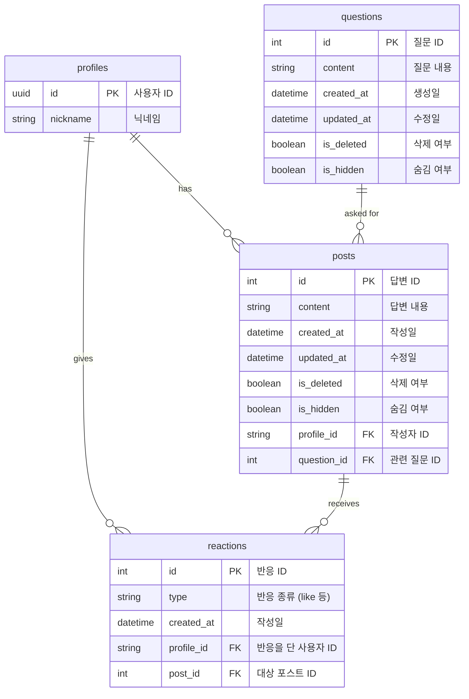

# 데이터 설계

## ERD

```mermaid
erDiagram
    profiles ||--o{ posts : "has"
    profiles ||--o{ reactions : "gives"
    questions ||--o{ posts : "asked for"
    posts ||--o{ reactions : "receives"

    profiles {
        uuid id PK "사용자 ID"
        string nickname "닉네임"
    }

    questions {
        int id PK "질문 ID"
        string content "질문 내용"
        datetime created_at "생성일"
        datetime updated_at "수정일"
        boolean is_deleted "삭제 여부"
        boolean is_hidden "숨김 여부"
    }

    posts {
        int id PK "답변 ID"
        string content "답변 내용"
        datetime created_at "작성일"
        datetime updated_at "수정일"
        boolean is_deleted "삭제 여부"
        boolean is_hidden "숨김 여부"
        string profile_id FK "작성자 ID"
        int question_id FK "관련 질문 ID"
    }

    reactions {
        int id PK "반응 ID"
        string type "반응 종류 (like 등)"
        datetime created_at "작성일"
        string profile_id FK "반응을 단 사용자 ID"
        int post_id FK "대상 포스트 ID"
    }
```

## 정책

- posts - Soft Delete
- reactions - Hard Delete
